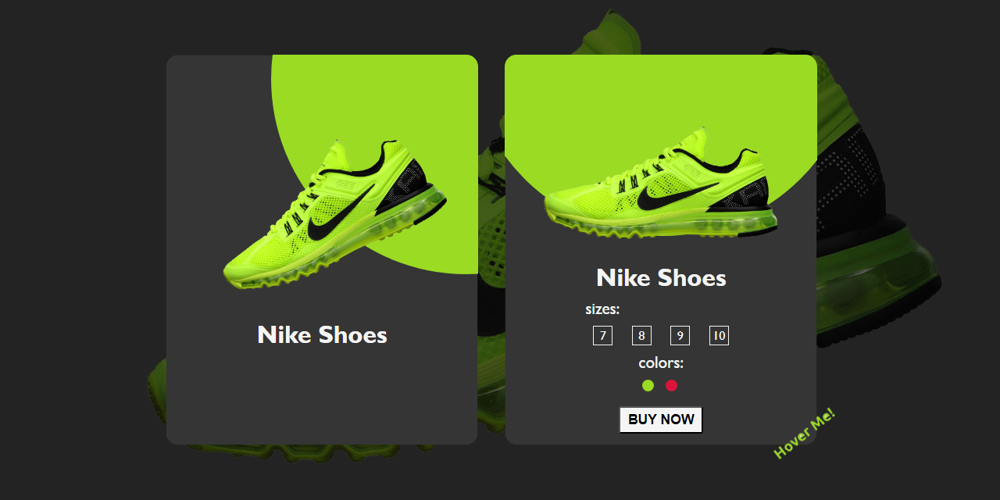

# Nike product card 

A product card component which you can use in your e-commerce app
 

 

## Table of Contents

-   [demo](https://github.com/Silent-Watcher/nike-product-card#demo)
-   [Contributing](https://github.com/Silent-Watcher/nike-product-card#Contributing)
-   [Contact](https://github.com/Silent-Watcher/nike-product-card#Contact)
-   [License](https://github.com/Silent-Watcher/nike-product-card#License)

## Demo

Experience the power of the nike-product-card by visiting the demo page.

You can try out the project by following this [demo link.](https://silent-watcher.github.io/nike-product-card/)

 

## Technologies

## Contributing 🤝🏾

Contributions to this project are welcome. 
If you encounter any issues or have suggestions for improvement, please open an issue on the GitHub repository.

Before contributing, please review the contribution guidelines.

## Contact

For additional information or inquiries, you can reach out to the project maintainer:

- Name: Silent-Watcher
- Email: alitabatabaee20@mail.com

Feel free to contact the maintainer for any questions or feedback regarding the project.

## License 🔐

[MIT](https://choosealicense.com/licenses/mit/)

This project is licensed under the MIT License. You are free to modify, distribute, and use the code for personal and commercial purposes. See the LICENSE file for details.

## Sponsor ❤
If you like this project, please give it a star ⭐ and/or consider buying me a coffee(s). Every donation is appreciated.

